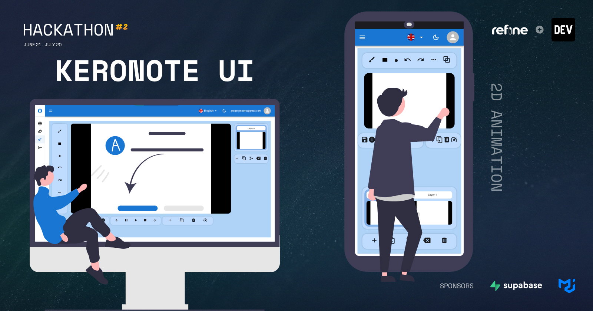
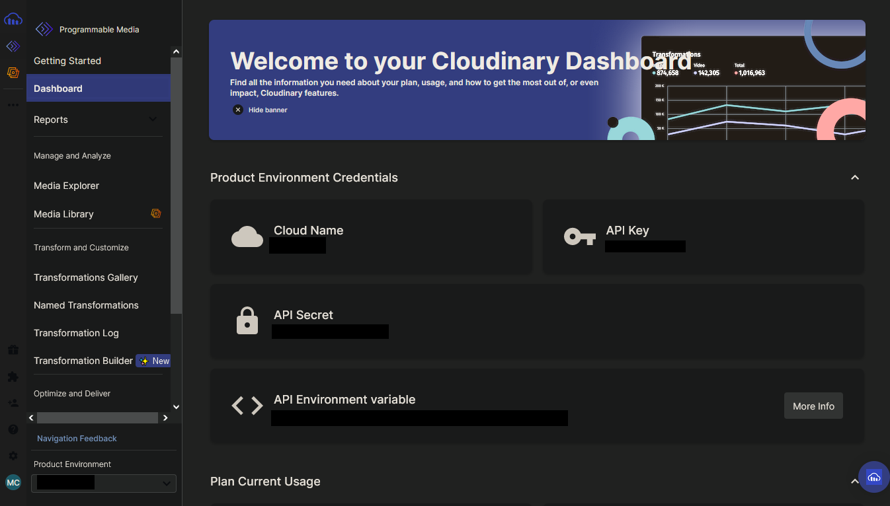
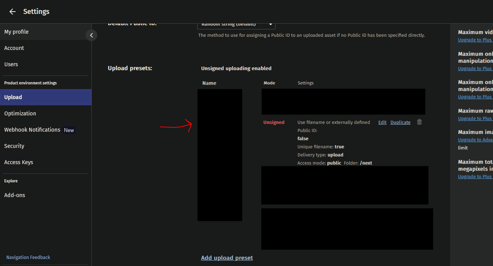
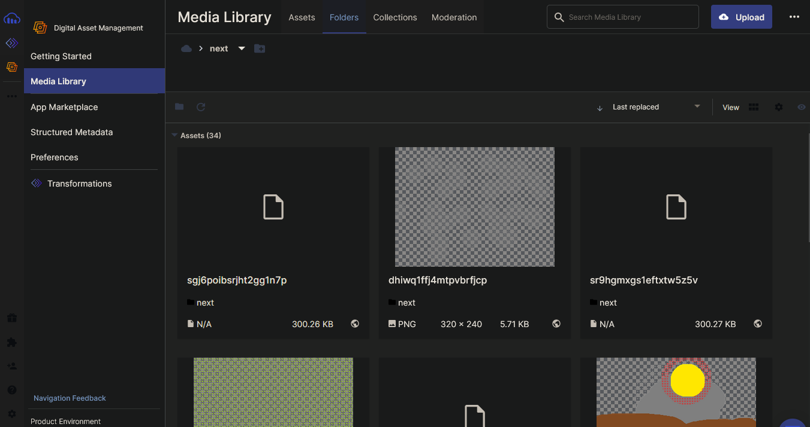
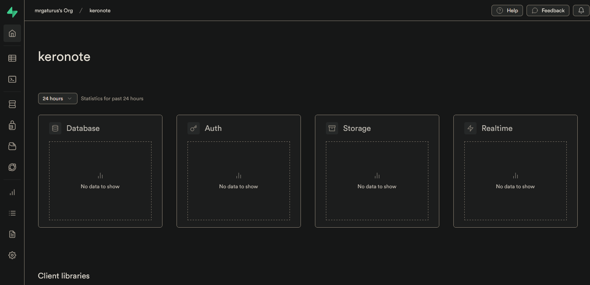
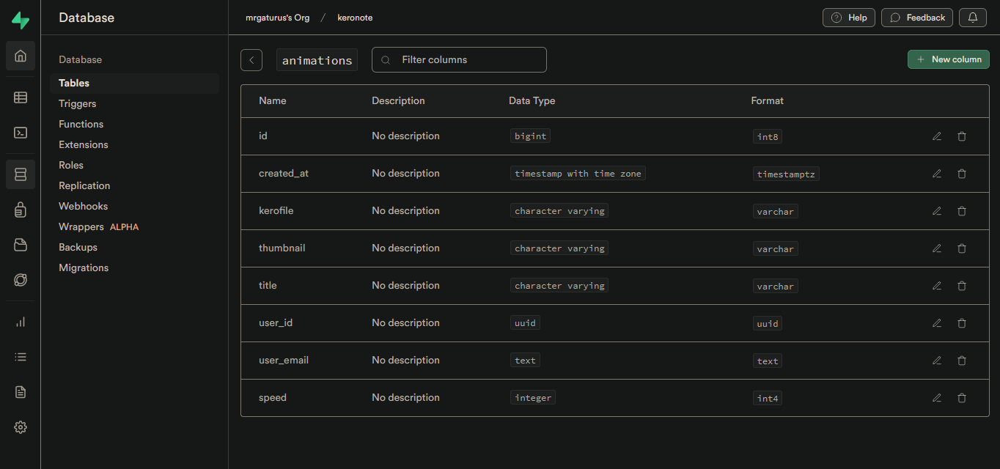
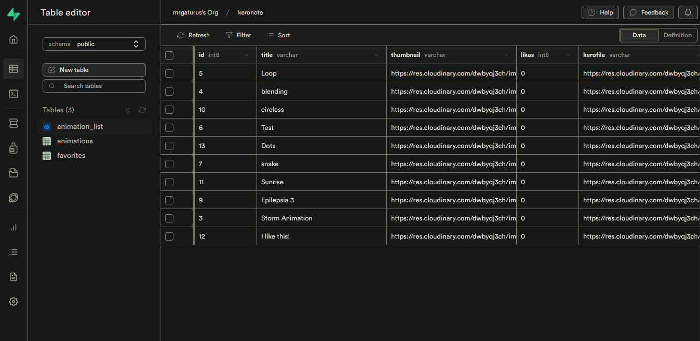

# keronoteui

<div align="center" style="margin: 30px;">
    
</div>
<br/>

This [refine](https://github.com/pankod/refine) project was generated with [superplate](https://github.com/pankod/refine).

## 🔗 Project Demo links

- [Netlify](https://deft-pithivier-b4a203.netlify.app).

## About

### Description
We love flipnote animations, but the main problem is you need a nintendo ds for create those animations. So we tried to do a simple animation software having inspiration on those features from flipnote studio, but at the same time improving and adding more features like layer system and extended color palette.

### Participants

* mrgaturus
  * [Github](https://github.com/mrgaturus/)
  * [Twitter](https://twitter.com/mrgaturus/)
  
* JuanViverosDev
  * [Github](https://github.com/JuanViverosDev)
  * [Twitter](https://twitter.com/HyperCreat500006/)
  
* GregoryInnovo
  * [Github](https://github.com/gregoryInnovo/)
  * [Twitter](https://twitter.com/GregoryInnovo/)

### Preview
To provide a comprehensive understanding of the submission, add visuals such as GIFs, images and videos have been incorporated to give an impression of what it looks like.
## Pages
[Demo Video](https://github.com/Media-Collab/keronoteui/assets/videos/Views.mp4)


### Set up Project

### Prerequisites

- Supabase account
- Cloudinary account
- node >=18
- npm


### Install Project

- Clone the repository:
```
git clone https://github.com/Media-Collab/keronoteui.git
```

- Change directory and install dependencies:

```
cd directory
npm install
```

- Create `.env` file to save the blobs:

```
CLOUDINARY_CLOUD_NAME=
CLOUDINARY_API_KEY=
CLOUDINARY_API_SECRET=
CLOUDINARY_UPLOAD_PRESET=
```

- Create your cloudinary account
<div align="left">
    
</div>

After create a product environment and appear in the console (section Programmable Media) copy the Cloud Name, API Key and API Secret.


- Go to the settings and create a preset (Make sure the mode is Unsigned)
<div align="left">
    
</div>

In the creation you can select which folder the images will stored (in this case we create a folder called next)

- Folders fullied
<div align="left">
    
</div>

- Create your supabase account
<div align="left">
    
</div>
In this case we are going to use Database and Authentication

- Create animations tables with the following rows
<div align="left">
    
</div>

- And create a view to get the data that we want
<div align="left">
    
</div>

- Run in development mode:

```
npm run dev
```

## Learn More

To learn more about **refine**, please check out the [Documentation](https://refine.dev/docs)

- **Cloudinary API** [Docs](https://cloudinary.com/documentation/image_upload_api_reference#overview)
- **Supabase Data Provider** [Docs](https://refine.dev/docs/core/providers/data-provider/#overview)
- **Material UI** [Docs](https://refine.dev/docs/ui-frameworks/mui/tutorial/)
- **Inferencer** [Docs](https://refine.dev/docs/packages/documentation/inferencer)
- **i18n** [Docs](https://refine.dev/docs/core/providers/i18n-provider/)

## Future?
- Development of likes system 👍
- Edit animations 🏃‍♂️ 🖌
- Delete creations ❌
- Discover the onion mode 🤔

## License

MIT
